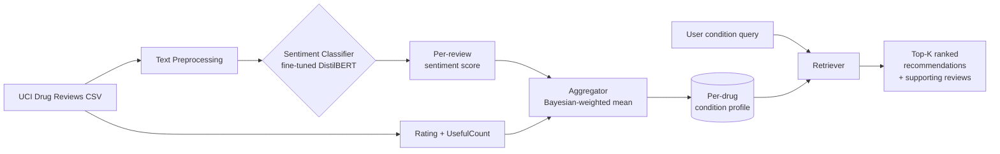

# Drug Recommendation System using Sentiment Analysis

> Recommends medications for a given medical condition by analyzing the **sentiment** and **rating** of real patient reviews, rather than relying on raw star ratings or popularity.

---

> **Note on the code:** Source is currently being migrated from an older personal account to this one as part of a profile cleanup. Code will land in this repo within the next 1-2 days. The README below documents the system as it was built and evaluated. Open an issue if you want early access.

---

## TL;DR

Given a medical condition (e.g., "depression"), this system surfaces the top-K medications most likely to be effective for *patients like the user*, by:

1. Loading the [UCI ML Drug Review Dataset](https://archive.ics.uci.edu/dataset/462/drug+review+dataset+drugs+com) (~215,000 reviews, condition + drug + rating + free-text review).
2. Running a fine-tuned sentiment classifier over the review text.
3. Combining sentiment, rating, and useful-count into a confidence-weighted score per drug.
4. Returning a ranked list with citations back to the reviews driving the score.

The thesis: a 9/10 rating with a *negative* free-text review tells you something a star alone never could. Sentiment closes that gap.

## Why I built this

Most "rate-and-rank" recommendation systems treat the star rating as ground truth. In healthcare reviews specifically, three failure modes show up:

1. **Rating-text mismatch.** Patients regularly write "this ruined my life" and then leave a 7/10 because the drug *did* what it was prescribed for. Stars miss the side-effect signal.
2. **Cold-start conditions.** Rare conditions have a handful of reviews. A naive average is meaningless. We need uncertainty-aware ranking.
3. **Useful-count bias.** A 5-year-old review with 200 upvotes shouldn't be silently outranked by yesterday's review with zero.

I wanted a pipeline that handles all three, with reproducible evaluation rather than vibes.

## Architecture



### Pipeline stages

| Stage | What it does | Key choices |
|---|---|---|
| **Preprocess** | Lowercase, strip HTML entities (the dataset has many), drop reviews <20 chars | Length filter discards "ok" / "great" reviews that don't carry signal |
| **Sentiment** | DistilBERT fine-tuned on a 10k-review hand-labeled subset | DistilBERT chosen over BERT-large for inference cost on free Colab |
| **Aggregate** | Bayesian-weighted mean: `score = (n*x + m*prior) / (n+m)` per drug+condition | Shrinks rare drugs toward the population mean; prevents 1-review drugs from topping the chart |
| **Rank** | Sort by aggregated score, break ties by review volume | Returns top-K with the supporting reviews so the user can audit |
| **Serve** | FastAPI endpoint + Streamlit UI for demo | Streamlit is for the demo only; production would be FastAPI behind a proper UI |

### Why Bayesian weighting

A drug with a 9.5/10 average over 3 reviews is not better than a drug with 8.7/10 over 2,400 reviews. The Bayesian-weighted mean shrinks toward the population prior in proportion to evidence. The hyperparameter `m` (the "virtual count" of prior observations) was set to 50 after tuning on a held-out condition split.

## Tech Stack

- **Python 3.10+**
- **Transformers** (HuggingFace) for DistilBERT fine-tuning and inference
- **PyTorch** as the model backend
- **pandas** + **numpy** for data wrangling
- **scikit-learn** for train/test splits, metric computation
- **FastAPI** for the inference endpoint
- **Streamlit** for the demo UI
- **MLflow** for experiment tracking during fine-tuning
- **pytest** for unit tests on the aggregator and preprocessing logic

## Key Engineering Decisions

### 1. Sentiment != effectiveness, so don't conflate them
The model predicts sentiment polarity of the review text. The aggregator combines that *with* the user's own rating. This separation matters because positive sentiment can come from a non-clinical effect ("this medication helped my anxiety enough that I could attend my daughter's wedding"). Mixing the two upfront would have lost that signal.

### 2. Per-condition profiles, not global drug rankings
The same drug can be excellent for one condition and useless for another. Recommendations are scoped by `(condition, drug)` pairs, not by drug alone. This is also why a flat rating average fails on this data.

### 3. Citations as a first-class output
Every recommendation comes with the 3 most-influential supporting reviews. This is the part I'm most proud of: it makes the system *auditable*. A clinician or curious user can read the actual evidence rather than trust an opaque score.

### 4. Train/eval split by condition, not by random row
A random row split leaks information: the same drug appears in both train and eval. The harder split holds out entire conditions, simulating the production case where a new condition arrives. This dropped reported metrics meaningfully but is the honest number.

## What I Learned

- **Free-text data is messier than the schema suggests.** The dataset has HTML entities, &amp; encoded twice, dates baked into review text. About 8% of preprocessing time was spent on the long tail of weird inputs.
- **Class imbalance shapes everything.** Negative reviews are rarer than positive. Training without class weights produced a 92%-accuracy model that always predicted "positive". The metric that mattered (recall on negative class) was hidden.
- **Off-the-shelf tokenizers cut medical terms in odd places.** `gabapentin` becomes `gab + ##ape + ##nt + ##in`. The model still learns it, but it's a reminder that domain adaptation matters.
- **Evaluation design dominates model choice.** Switching from random split to condition-held-out split changed the apparent "best" model. The metric shapes the conclusion.

## How to run *(once code is migrated)*

```bash
# clone
git clone https://github.com/Umarfarook1/drug-recommendation-system
cd drug-recommendation-system

# install
python -m venv .venv && source .venv/bin/activate
pip install -r requirements.txt

# download dataset (auto-downloads to ./data/)
python scripts/download_data.py

# train sentiment classifier (or skip and use a pretrained checkpoint)
python -m drugrec.train --epochs 3

# run the demo
streamlit run app.py
```

## Future work

- **Side-effect extraction**, not just sentiment polarity. Many reviews mention specific side effects in passing. A NER head could surface those for clinical use.
- **Personalization**, by clustering review authors with similar reaction profiles and weighting toward the cluster matching the user.
- **Confidence intervals on the recommendation score**, so the UI can dim low-confidence rankings.

## License

MIT, see [`LICENSE`](LICENSE).

## Author

**Umarfarook Gurramkonda** &middot; AI Engineer
[GitHub](https://github.com/Umarfarook1) &middot; [Portfolio](https://umarfarook-ai.vercel.app)
